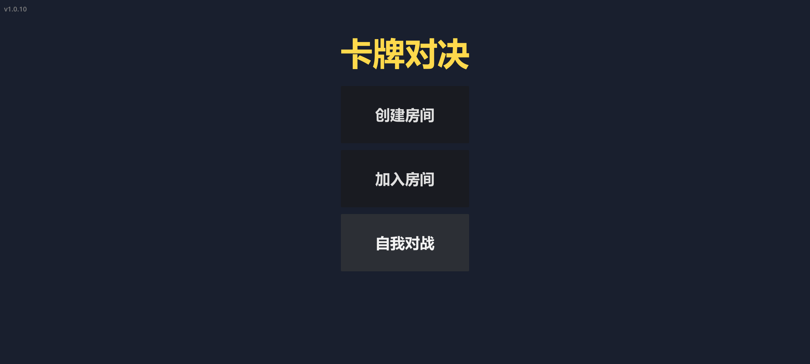
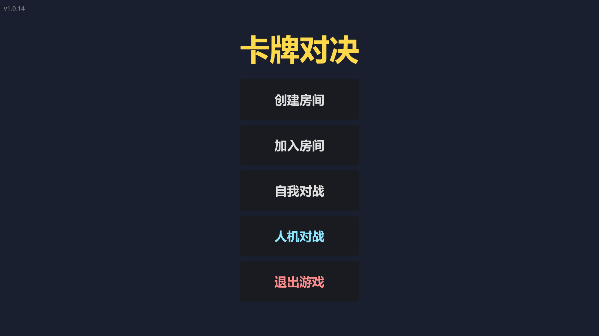

# 卡牌对决 (Card Duel)

双人对战回合制卡牌游戏。78 张共享牌堆、8 名角色、11 格棋盘，在横线棋盘上通过卡牌攻防博弈。





## 玩法亮点

- **BP 禁选**：开局双方各禁一个角色，再轮流选择——先手随机
- **8 名角色**：剑士 / 弓手 / 法师 / 圣骑士 / 刺客 / 牧师 / 狂战士 / 术士，各有独特主动技能与被动
- **78 张共享牌堆**：近战 / 远程 / 魔法攻击、移动、吸引 / 威慑 / 冻结 / 摧毁 / 夺取、回复、数值强化、天赐 / 陷阱、武器幻化、防具
- **响应博弈**：攻击可被格挡（近战）/ 牵制（远程）/ 闪避（魔法）——猜对方手牌是核心乐趣
- **人机对战**：三档难度 AI（简单 / 普通 / 困难），单机随时可玩
- **结算统计**：每局展示伤害 / 治疗 / 出牌 / 复活统计，获胜者按表现获得称号（无伤传说、毁灭之王、不死凤凰……）
- **服务端权威联机**：WebSocket 对战，手机 / 电脑跨端

## 技术栈

- Godot 4.7 + GDScript（GL Compatibility 渲染器）
- 服务端权威架构：`scripts/core/match_state.gd` 是唯一权威状态机，客户端纯 UI 转发
- WebSocket 联机（云服务器 headless 跑服务端）
- Android / Windows 双端构建（GitHub Actions 自动打包）

## 运行

```bash
git clone https://github.com/41hu/card_duel.git
# 用 Godot 4.7 打开 project.godot，F5 运行
# Android 真机：CI 构建的 APK 在 GitHub Releases（游戏内自动检测更新）
```

联机对战服务器：`ws://47.107.47.251:17890`

---

## 文档索引

| 文档 | 作用 |
|---|---|
| `EXTENSION_GUIDE.md` | **扩展操作手册**：加卡/角色/武器/buff/技能/场景/统计的必改清单 + **结算优先级规范** |
| `API_REFERENCE.md` | 方法级参考：每个脚本/方法/信号的用途、网络协议 |
| `WORKFLOW.md` | 架构、游戏流程、网络协议、已知 bug 清单、测试方法 |
| `GAME_RULES.md` | 完整游戏规则（卡牌/角色/防具/复活/BP） |
| `RESPONSE_RULES.md` | 响应（格挡/牵制/闪避）与结算细节 |

---

## 给 AI 协作开发者的说明

你被邀请参与此项目的开发。**先确认你的身份**：
- 如果你是**主维护者的 AI**（负责推送更新、UI、手机适配、修复 bug）：按"文件职责划分"工作
- 如果你是**平衡性开发者的 AI**（负责游戏平衡性调整）：跳到"给平衡性开发者的专属指引"小节

### 给平衡性开发者的专属指引

你的唯一职责：**游戏平衡性调整**——调整角色数值、卡牌强度、技能效果。不修 UI bug、不做新功能系统、不动推送更新相关代码。

**你可以改的**：
- `scripts/autoload/config.gd` — 卡牌数据（`CARD_DB`/`CARD_COUNTS`）、角色属性、武器效果数值
- `scripts/core/character_skills.gd` — 角色技能逻辑
- `scripts/core/card_effects.gd` — 卡牌效果逻辑
- `scripts/core/combat_system.gd`、`movement_system.gd`、`status_system.gd`、`equipment_system.gd`、`bp_system.gd`、`card_system.gd`、`match_state.gd` — 相关规则逻辑
- `GAME_RULES.md`、`RESPONSE_RULES.md` — 同步更新你改动的规则文档

**你绝对不能改的**：`scripts/ui/`、`scenes/`、`scripts/version.gd`、`scripts/theme/`、`.github/`、`export_presets.cfg`、`deploy.sh`、`start_server.sh`、`project.godot`

**平衡性改动自检清单**（改完逐项确认）：
1. 数值一致性：`CARD_COUNTS` 各卡数量总和仍为 78？角色仍为 8 名？武器/防具池数量与文档一致？
2. 改 `scripts/core/` 后**必须通知主维护者部署服务器**（服务端跑的是同一套逻辑，不部署则联机对战不生效）
3. 提交前用**自我对战**跑一局验证：主菜单 → 自我对战 → 随机选两个角色 → 完整走完一局

**提交规范**：提交信息以 `balance:` 开头（如 `balance: 剑士HP 28→26`），push 前先 `git pull --rebase`。

### 开始工作前

1. **加新东西先读 `EXTENSION_GUIDE.md`**（必改清单 + 结算优先级规范，照做不踩坑）
2. **改代码前先查 `API_REFERENCE.md`**（方法/信号/协议）
3. 读 `WORKFLOW.md` 了解架构与已知 bug 清单（第六节）
4. 平衡性数值以 `GAME_RULES.md` / `RESPONSE_RULES.md` 为准

### 文件职责划分（多人协作防冲突，重要）

本项目有两位维护者，分工不同。**只改自己区域的代码，公共区改动前先看是否影响对方**：

| 区域 | 文件 | 归属 |
|---|---|---|
| **平衡性**（另一位开发者） | `scripts/autoload/config.gd`、`scripts/core/` 全部、`GAME_RULES.md`、`RESPONSE_RULES.md` | 另一位开发者 |
| **推送更新 + UI/手机适配**（主维护者） | `scripts/version.gd`、`scripts/ui/` 全部、`scenes/` 全部、`scripts/theme/`、`.github/`、`export_presets.cfg`、部署脚本 | 主维护者 |
| **公共区** | `project.godot`、`README.md`、`WORKFLOW.md` | 谁改谁负责，改完通知对方 |

三条铁律：
1. **`scripts/version.gd` 只有主维护者能改**（版本号与 CI 发布、游戏内更新提示联动）
2. **改完 `scripts/core/` 的代码必须通知主维护者部署服务器**（服务端跑同一套权威逻辑）
3. **不要修改 `scripts/ui/` 和 `scenes/` 下的任何文件**（UI 及手机端适配由主维护者负责）；UI 层发现 bug **只报告不修改**

协作流程：改自己区域 → 提交 → **`git pull --rebase`**（冲突在此步本地解决）→ `git push`。

### 开发铁律（每改一处代码必问三件事）

1. **服务端需要改吗？** `match_state.gd` 是唯一权威状态机，客户端 UI 不做判定只转发
2. **本地模式要同步吗？** `local_game.gd`（自我对战/人机）与联机共用同一 MatchState，行为必须一致
3. **改完发状态更新了吗？** 任何状态变更后要广播 `game_state`

### 代码规范（违反会导致运行错误）

- GDScript 用 **Tab 缩进**，不要用空格
- `match` 是关键字，不能当变量名
- `preload` 必须在引用前声明（const 顺序）
- 服务端 `tcpserver.listen(PORT)` 不要绑 `127.0.0.1`（外网连不上）
- GDScript lambda **不能修改外层局部变量**（要收集结果请用直接比较）
- `replace_all` 谨慎使用，容易误伤

### 如何测试你的改动

**本地自我对战（推荐，最快）**：主菜单 → 自我对战 → 随机选两个角色开打。能完整走完：BP、出牌、移动、响应、弃牌。
**人机对战**：主菜单 → 人机对战 → 选难度/角色（debug 构建左上角有"调试"按钮可立即胜利/失败/发牌）。
**联机测试**：`ws://47.107.47.251:17890`（需要云服务器，仅自我对战测不了时用）。
